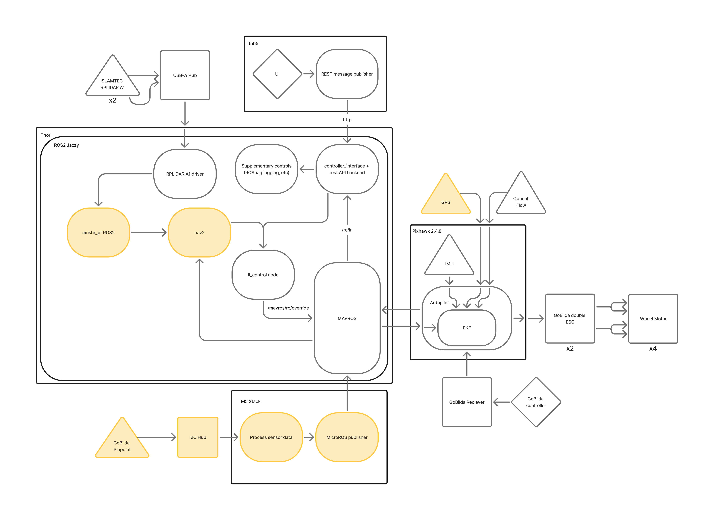

# Opendubs
Mobile manipulation stack for research and education.

## Setup
TODO: container setup

Run udev script outside of container:
```bash
./scripts/create_udev_rules.sh
```

Ensure dependencies are installed in container:
```bash
cd <workspace_name>/opendubs-core
rosdep install --from-paths src -y --ignore-src
```

Set the robot on a bench for its first test. Since many ardupilot parameters need a reboot before applying, we'll have to launch an extra time during setup:
- Launch the system with `ros2 launch main robot_launch.py`
- Wait until a message saying the parameters have been set
- Kill the launch process
- Reboot ardupilot (one way is to unplug and replug the pixhawk)
- Launch the system again

## Launch
Main robot launch:
```bash
ros2 launch main robot_launch.py # no GCS
# or
ros2 launch main robot_launch.py gcs_url:=udp://@<ip>
```
This brings up all main robot functionality, including the mavros bridge, sensors, data logging, and robot control.

To view the robot in rviz:
```bash
ros2 launch descriptors display_launch.py
```

To launch the mocap client:
```bash
ros2 launch main open_dubs_mocap car_odom_publisher_launch.py
```

## Configuration
In order to change any core robot parameters, edit the [single-source-of-truth params file](src/main/config/robot_params.yaml). 

In the file, there is a section called `mavros_params_loader` which is used for setting mavros params once they are available. This is processed in [mavros_launch.py](src/main/launch/mavros_launch.py) where each section (i.e. params or local_position) denotes the node which the params belong to and each line under the `ros__parameters` header of this section is the parameter name and value to set. 

[!NOTE]
Some of these parameters might require an ardupilot reboot to take effect. This means you might have to launch the system until the params are set, reboot the pixhawk, and launch the system again.

## Data Logging
In order to enable or disable data logging, run:
```bash
ros2 service call /record_data interfaces/srv/LoggerCommand "{command: <cmd>}"
```
where \<cmd> is:
- 0 for START_RECORDING
- 1 for STOP_AND_DISCARD_RECORDING
- 2 for STOP_AND_SAVE_RECORDING

This can also be run wirelessly through HTTP posts:
```bash
http://<ip>:<port>/logger/start             # start logging
http://<ip>:<port>/logger/stop_and_save     # stop and save
http://<ip>:<port>/logger/stop_and_discard  # discard
```

and you can also retrieve the logging status with an HTTP get:
```bash
http://<ip>:<port>/logger/status
```

One way to do this is with an ESP32 script, [like this one](https://github.com/rajitzg/Tab5-Frontend) designed for the [M5Stack Tab5](https://shop.m5stack.com/products/m5stack-tab5-iot-development-kit-esp32-p4). This allows for a permanent wireless touchscreen interface for additional robot controls.

## System Architecture

Flowchart of the system. Yellow items are WIP.

